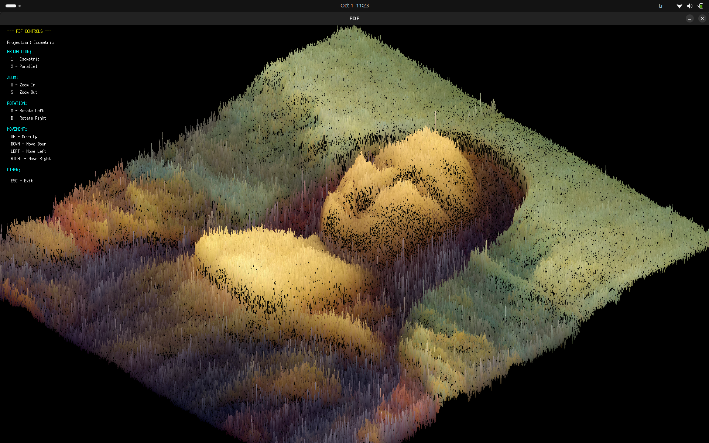

# FdF - 42 Project

FdF is a 42 school project that consists of creating a simplified 3D wireframe representation of a relief landscape by connecting various points (x, y, z) with segments (edges).

---

## 📌 Project Overview

- **Goal:** Display a 3D map in isometric projection.
- **Language:** C
- **Library:** MiniLibX (graphic library provided by 42)
- **Concepts Covered:**
  - Reading and parsing a map file
  - Using structures to store 3D points
  - Applying projection transformations
  - Drawing pixels and lines
  - Handling user input (zoom, move, rotate)

---

## ⚙️ Features

- Isometric projection of 3D maps
- Adjustable zoom
- Move (translate) map around window
- Rotate map (X, Y, Z axes)
- Change projection (parallel / isometric)
- Exit program with `ESC`

---

## 🖼️ Example

Here is an example of the output:



*

---

## 🛠️ Compilation & Usage

### 1. Clone repository
```bash

git clone https://github.com/VedatZeybek/42-fdf.git

cd 42-fdf

make && make bonus && make clean && make tests

./fdf_bonus test_maps/monalisa.map
